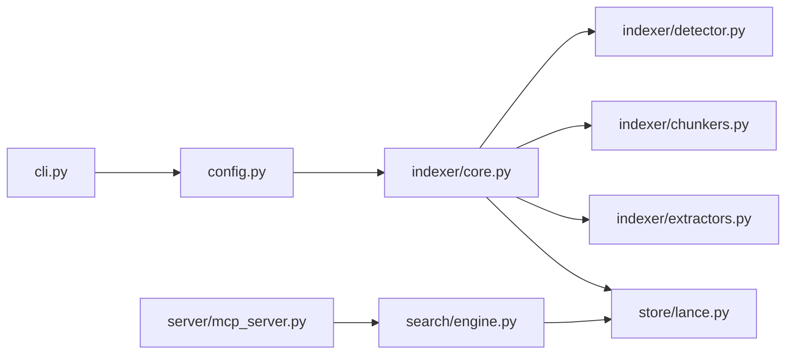

# Architecture

## 1. Overview

`codebase-rag` is a local RAG system for source code. It discovers repositories in a workspace, chunks and embeds relevant files with Ollama (`nomic-embed-text`), stores vectors and metadata in LanceDB, and exposes semantic retrieval through both a CLI and an MCP server (stdio) so AI assistants can fetch focused context instead of re-reading entire codebases.

## 2. Data Flow

```mermaid
flowchart TD
    A[Workspace files] --> B[detector.py\ndetect_stack]
    B --> C[chunkers.py\nchunk_file]
    B --> D[extractors.py\nextract_structured]
    C --> E[Ollama\nembed_chunks(model=nomic-embed-text)]
    E --> F[LanceDB\nLanceStore.upsert_chunks]
    D --> F
    F --> G[SearchEngine\nsearch/engine.py]
    G --> H[MCP Server\n4 tools over stdio]
    H --> I[AI Assistant]
```

The orchestration lives in `index_workspace()` and `index_repo()` in `src/codebase_rag/indexer/core.py`, with embeddings generated by `embed_chunks()` and persisted via `LanceStore`.

## 3. Components



- `src/codebase_rag/cli.py`: Click entrypoint (`init`, `index`, `search`, `stats`, `serve`) for local workflow and MCP bootstrap.
- `src/codebase_rag/config.py`: Loads/saves workspace config, including embedding model and include/exclude/chunking settings.
- `src/codebase_rag/indexer/core.py`: End-to-end indexing orchestration: repo discovery, file walking, chunking, embedding, upsert, structured extraction, summary creation, and metadata persistence.
- `src/codebase_rag/indexer/detector.py`: Repository stack/profile detection (`detect_stack`) used to tune indexing behavior and summary metadata.
- `src/codebase_rag/indexer/chunkers.py`: Language-aware chunk generation (`chunk_file`) with line ranges and symbol metadata.
- `src/codebase_rag/indexer/extractors.py`: Structured extraction (`extract_structured`) for categories like routes, migrations, env, docker, and models.
- `src/codebase_rag/store/lance.py`: LanceDB-backed storage layer (`LanceStore`) for vector rows, structured JSON artifacts, summaries, and stats.
- `src/codebase_rag/search/engine.py`: Query-time embedding + store search + result normalization into `SearchResult`.
- `src/codebase_rag/server/mcp_server.py`: FastMCP server registration and tool wrappers (`rag_search`, `rag_lookup`, `rag_summary`, `rag_reindex`) over stdio.

For stack-specific behavior and defaults, see [supported-stacks.md](supported-stacks.md) and [configuration.md](configuration.md).

## 4. Storage Layout

`LanceStore` computes a workspace-scoped index directory using:

- Absolute, resolved workspace path
- Hash formula: `sha256(str(workspace_path).encode()).hexdigest()[:16]`
- Base data dir: `CODEBASE_RAG_DATA_DIR` env var, or default `~/.local/share/codebase-rag`

Resulting layout:

```text
~/.local/share/codebase-rag/indexes/{workspace_hash_16}/
├── chunks.lance/                         # LanceDB table name: "chunks"
├── structured/
│   └── {repo_name}/
│       └── {category}.json               # save_structured(repo, category, data)
├── summaries/
│   └── {repo_name}.json                  # save_summary(repo, summary)
└── metadata.json                         # file_mtimes + file_chunk_counts
```

Notes:

- `VECTOR_DIM = 768` in `src/codebase_rag/store/lance.py` (for `nomic-embed-text`).
- `metadata.json` is maintained by `src/codebase_rag/indexer/core.py` for incremental indexing state.

## 5. Indexing Pipeline

`index_workspace()` discovers repos, initializes one `LanceStore`, and indexes each repo via `index_repo()`.

Full indexing (`--full`):

1. Walk all matched files (`walk_files`) under each repo.
2. Delete existing repo vectors first (`LanceStore.delete_repo`).
3. Chunk all files (`chunk_file`).
4. Embed chunks in batches via Ollama (`embed_chunks`).
5. Upsert vectors (`LanceStore.upsert_chunks`).
6. Extract/save structured data and summary.
7. Rebuild metadata (`file_mtimes`, `file_chunk_counts`).

Incremental indexing (default):

1. Load prior `metadata.json`.
2. Compare each file's current `st_mtime` against stored `file_mtimes`.
3. Skip unchanged files; process only changed/new files.
4. Remove metadata entries for deleted files.
5. Recompute embeddings/upserts only for processed files.
6. Re-run structured extraction and refresh summary.

Code-level constants used by the pipeline:

- `EMBED_BATCH_SIZE = 100`
- `MAX_FILE_SIZE_BYTES = 1024 * 1024` (1 MiB)

Both are defined in `src/codebase_rag/indexer/core.py`.

## 6. Search Pipeline

Search flow in `src/codebase_rag/search/engine.py`:

1. Accept query and optional filters (`repos`, `filetypes`, `limit`).
2. Embed query with Ollama (`client.embed(model=<embedding_model>, input=[query])`).
3. Execute LanceDB vector search through `LanceStore.search(...)`.
4. Apply optional filters:
   - Repo filter: `repo_name IN (...)`
   - Language filter: `language IN (...)`
5. Convert distance to score and rank descending.

Score formula in `src/codebase_rag/store/lance.py`:

$$
\text{score} = \frac{1}{1 + \text{distance}}
$$

The search results are normalized into `SearchResult` entries with chunk text, file path, repo name, line range, language, chunk type, optional symbol, and score.

At runtime, `src/codebase_rag/server/mcp_server.py` exposes this pipeline through four FastMCP tools over stdio transport:

- `rag_search`
- `rag_lookup`
- `rag_summary`
- `rag_reindex`
